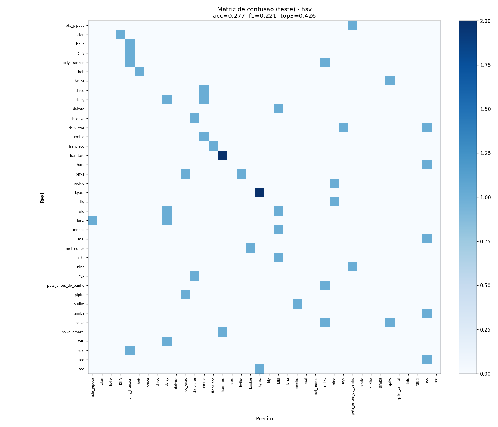
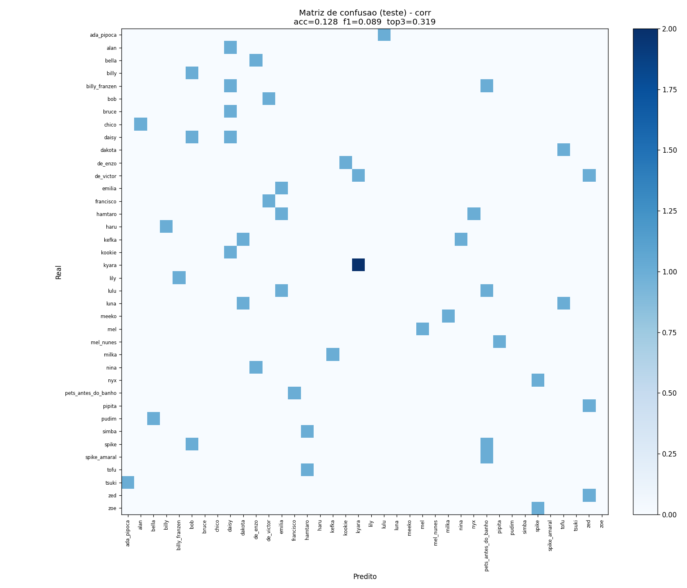
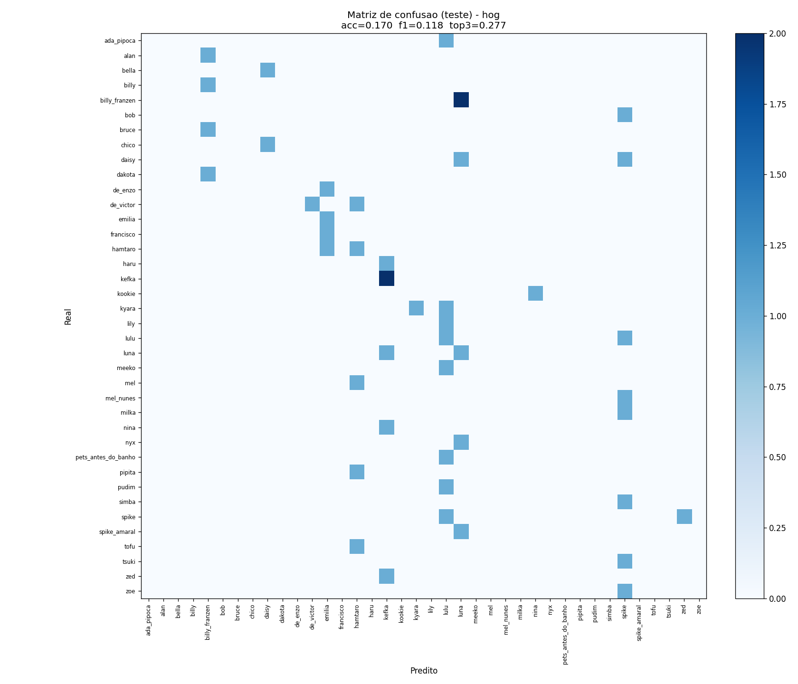
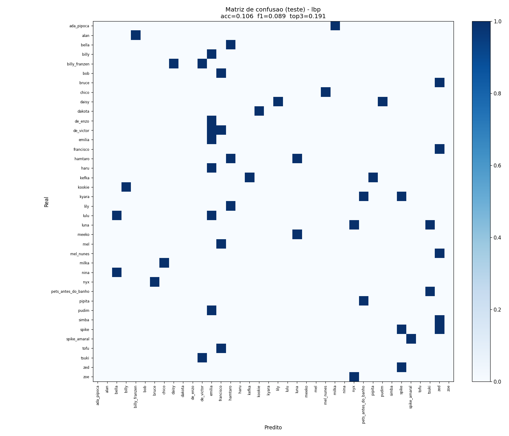
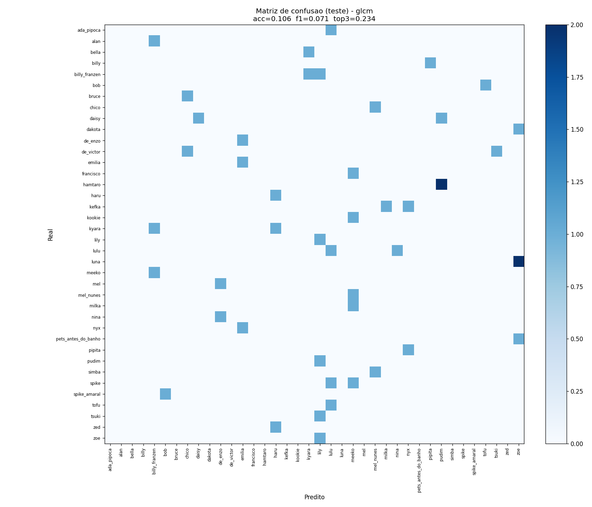
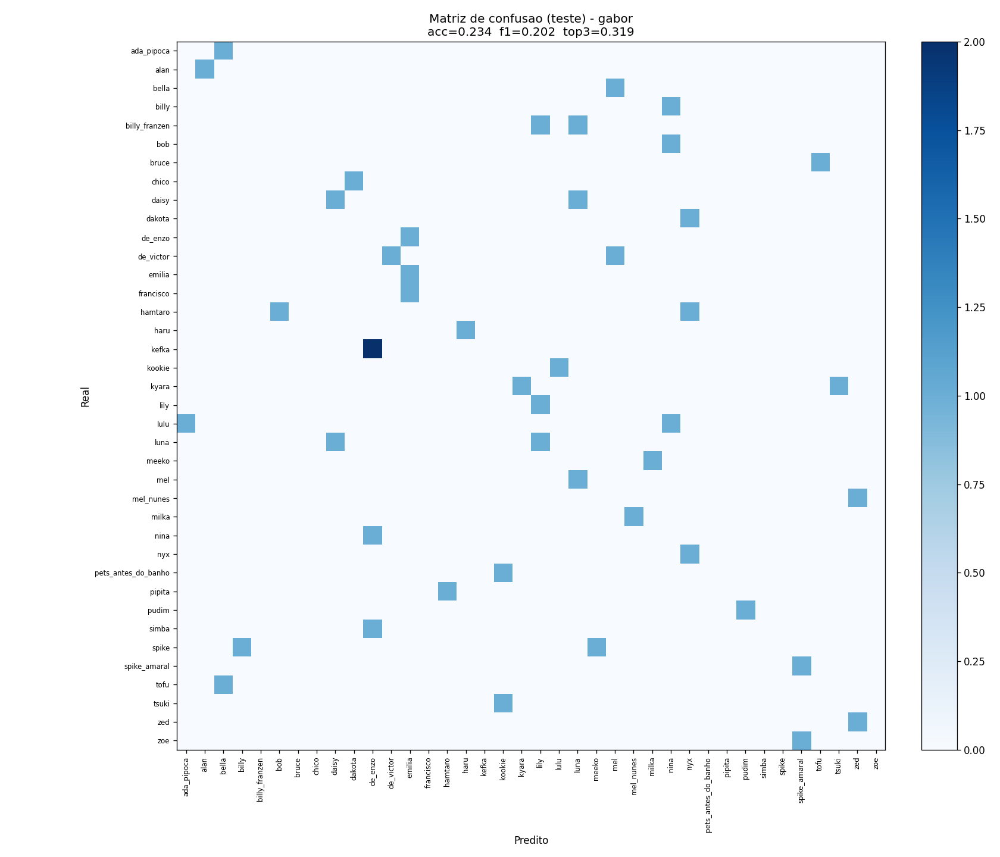
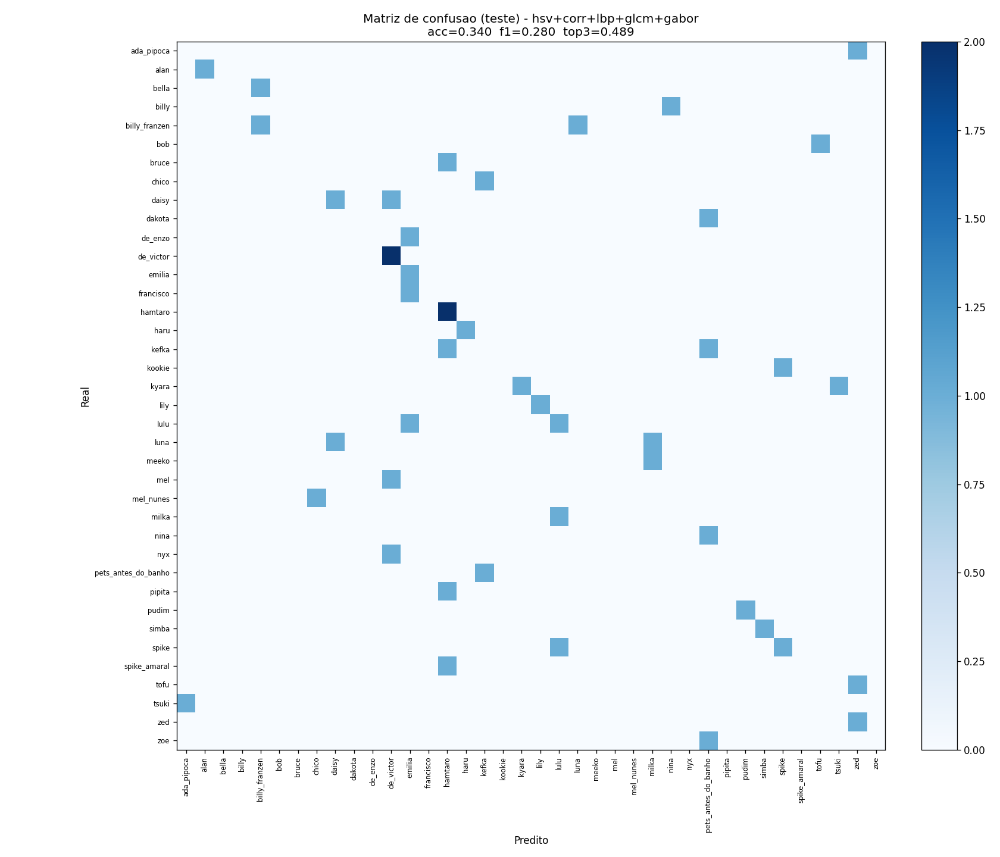
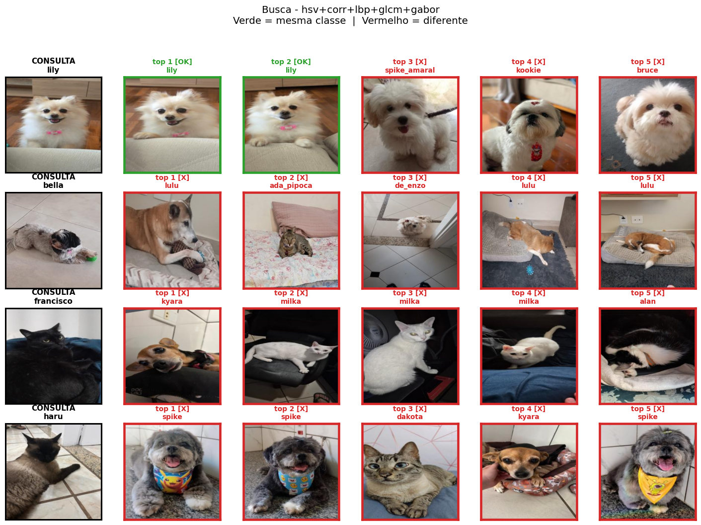
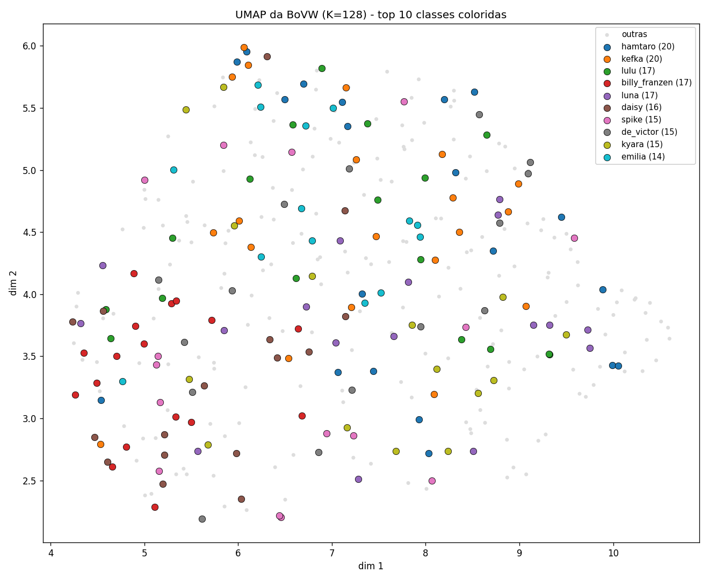
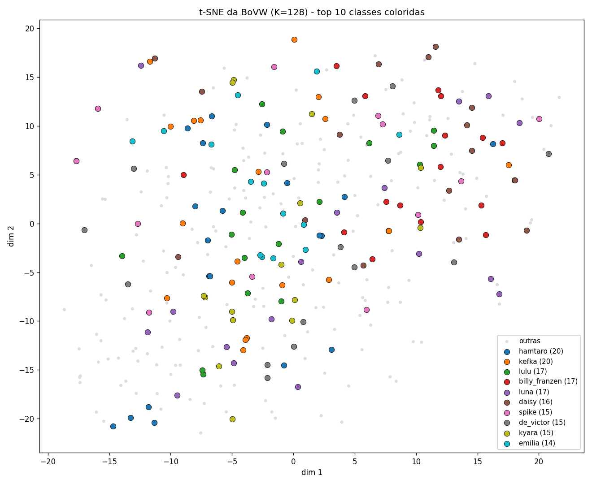

# Relatório Trabalho 3 — Processamento de Imagens

**Sistema de busca e classificação de animais de estimação**

Nome: Letícia Barbosa Neves
nUSP: 14588659
Semestre: 2026/1
Disciplina: SCC0251 (Processamento de Imagens)

---

## 1. Introdução

Este trabalho construiu um sistema de **classificação** e **busca por similaridade** sobre uma base de 367 fotos de 43 pets diferentes. Foram selecionados 7 descritores de imagem, extraídos para todas as imagens da base e depois avaliados isoladamente e em combinações, tanto para classificar a foto (identificar de qual pet é) quanto para recuperar fotos visualmente parecidas dada uma consulta.

### Métricas de avaliação

Como as duas tarefas aparecem o tempo todo nas tabelas, segue um resumo das métricas usadas (o cálculo em detalhe está nas seções 4 e 5):

**Classificação:**

- **Acurácia (validação / teste):** fração de imagens classificadas no pet correto.
- **Top-3:** fração em que o pet correto está entre as **3 classes mais prováveis** — informativa num problema de 38 classes, onde "quase acertar" é comum.
- **F1-score ponderado:** média harmônica de precisão e revocação por classe, ponderada pelo tamanho da classe. Mais justa que a acurácia numa base **desbalanceada** (penaliza errar as classes pequenas).

**Busca:**

- **P@1 e P@5 (precision@k):** entre os *k* vizinhos mais próximos da consulta, a fração que é do **mesmo pet**.
- **mAP (mean Average Precision):** média da precisão ao longo de **todo o ranking**, normalizada pelo número de imagens relevantes de cada classe. É a métrica padrão de *retrieval* e, diferente do P@k, não tem "teto" artificial quando a classe tem poucas fotos.

> A aula de Descritores apresenta as **distâncias de similaridade** (Euclidiana e Log) usadas para comparar descritores — que é o que o enunciado pede para a busca. Já **mAP, F1 e P@k** são métricas de *avaliação* padrão da área (não fazem parte do conteúdo de aula); adotamos por serem mais robustas que a acurácia pura num cenário com muitas classes pequenas e desbalanceadas.

### Organização do Código

| Arquivo / Pasta | Conteúdo |
| --- | --- |
| `codigos/descritores.py` | 7 extratores (HSV, Correlograma, HOG, LBP, GLCM/Haralick, ORB, Gabor) |
| `codigos/extrai_features.py` | Pipeline de extração — salva todos os descritores em `.npy` |
| `codigos/classificacao.py` | Split estratificado por classe (≈74/13/13) + SVM (kernel/C na validação) + matriz de confusão |
| `codigos/busca.py` | Busca por distância euclidiana + métrica P@k |
| `codigos/bovw.py` | KMeans sobre ORB → histograma de visual words |
| `codigos/visualizacao.py` | UMAP + t-SNE da BoVW |
| `features/` | Vetores extraídos (`.npy` / `.pkl`) |
| `resultados/` | Tabelas e figuras geradas |

### Instalação de dependências e inicialização

Para instalar as bibliotecas necessárias:

```bash
pip install numpy matplotlib imageio scikit-image scikit-learn umap-learn
```

Para executar o pipeline completo, no diretório do trabalho:

```bash
python codigos/extrai_features.py
python codigos/classificacao.py
python codigos/busca.py
python codigos/bovw.py
python codigos/visualizacao.py
```

---

## 2. Base de dados

- **367 imagens** em formato 256×256 RGB, distribuídas em **43 classes** (pets). *(O enunciado menciona 42 pets, mas o CSV/base efetivamente entregue contém 43 classes distintas; usamos os dados fornecidos.)*
- Distribuição muito desbalanceada: classes vão de **1 a 20 imagens** por pet (kefka e hamtaro têm 20; vários pets têm apenas 1 ou 3 fotos).
- **5 classes têm apenas 1 imagem** (todos os `de_bruno_*`) — excluídas da classificação conforme a regra do enunciado ("pets com menos de 3 fotos não entram"). Total efetivo para classificação: **362 imagens / 38 classes**.

---

## 3. Descritores escolhidos

Foram selecionados 7 descritores cobrindo aspectos complementares da imagem: **cor** (HSV), **cor com informação espacial** (Correlograma), **forma** (HOG), **textura local** (LBP), **textura por co-ocorrência** (GLCM/Haralick), **pontos-chave** (ORB) e **textura multi-escala** (Gabor). A ideia foi escolher descritores que respondem a perguntas diferentes sobre o pet ("de que cor é?", "como as cores se distribuem no espaço?", "qual o contorno?", "qual o padrão do pelo?", "como as intensidades se co-ocorrem?", "tem pontos marcantes?", "que escalas/orientações de padrão aparecem?"), pois para a tarefa de identificar um pet nenhuma característica isolada deveria ser suficiente.

Para cada descritor abaixo, apresentamos: a **justificativa da escolha**, a **semântica** capturada, a **hipótese** sobre as duas tarefas, o **resultado observado** e uma análise se a hipótese foi confirmada.

### 3.1 Histograma HSV — cor

**Justificativa da escolha:** escolhemos HSV porque a primeira coisa que diferencia pets visualmente é a **cor do pelo**. HSV separa matiz (H) de brilho (V), o que é mais robusto a variação de iluminação do que histograma RGB simples — duas fotos do mesmo pet em luzes diferentes têm cores RGB diferentes mas matiz parecida.

**Semântica capturada:** distribuição global de cor (quanto há de cada matiz, saturação e brilho), ignorando posição espacial.

**Implementação:** `color.rgb2hsv` (mesmo import do notebook `Aula17` da professora) + `np.histogram` em cada canal. Dimensão final: 96 (3 canais × 32 bins, normalizado L1).

**Hipótese:**

- **Classificação:** deve ser o descritor mais forte isoladamente, porque muitos pets têm cor de pelo característica.
- **Busca:** deve recuperar pets de cor parecida com a consulta, mesmo quando não acertar o pet exato.

**Resultado observado:** classificação acc = 27.7% (top-3 = 42.6% — **o melhor entre os descritores isolados** nas duas métricas), busca P@1 = 25.1% (mAP = 0.105). É o descritor de **cor** mais informativo e a base de praticamente toda boa combinação.

**Confirmou a hipótese?** Sim. A matriz de confusão mostra confusões concentradas em pets de cores próximas; nos rankings de busca, vizinhos errados são tipicamente pets da mesma faixa cromática (branco fofo, caramelo, preto).



### 3.2 Correlograma de Cores — cor com informação espacial

**Justificativa da escolha:** o Correlograma de Cores é um descritor de cor da **aula de Descritores** que, diferente do histograma global (HSV), **preserva informação espacial** — mede a probabilidade de encontrar a mesma cor a uma certa distância. Foi escolhido para complementar o HSV (que ignora posição), capturando padrões como manchas e a distribuição espacial da pelagem.

**Semântica capturada:** com que frequência pixels de uma mesma cor ocorrem próximos uns dos outros (autocorrelação de cor por distância).

**Implementação:** autocorrelograma no canal de matiz (H do HSV) quantizado em **16 bins**, para distâncias 1, 3 e 5 (8 direções por distância). Dimensão final: 16 × 3 = **48**.

**Hipótese:**

- **Classificação:** modesto sozinho, mas complemento útil de cor com aspecto espacial.
- **Busca:** deve recuperar pets com distribuição de cor parecida; bom em combinação com HSV.

**Resultado observado:** classificação acc = 12.8% (top-3 = 31.9%), busca P@1 = 18.5%, mAP = 0.092 — **acima de LBP e GLCM na busca**, com 48 dimensões. **Entra nas duas melhores combinações:** `hsv+corr+lbp+glcm+gabor` é a melhor na classificação por validação (acc val = 34.0%) e na busca (mAP = 0.140, P@1 = 32.3%).

**Confirmou a hipótese?** Sim — sozinho é modesto, mas seu aspecto espacial soma de verdade: adicioná-lo elevou tanto a melhor classificação (val 0.319 → 0.340) quanto a melhor busca (mAP 0.138 → 0.140). Limitação conhecida: usar só o canal H descarta saturação e brilho.



### 3.3 HOG — forma / gradientes

**Justificativa da escolha:** HOG foi escolhido para capturar a **silhueta** do pet — descritor canônico para "forma" em visão computacional clássica, baseado em histogramas de orientação de gradiente (a ideia de gradiente/borda aparece na aula de Descritores). A hipótese era que pets com proporção corporal distinta (orelha em pé vs caída, focinho curto vs longo) teriam padrões de gradiente característicos.

**Semântica capturada:** histograma local de orientações de gradiente em uma grade sobre a imagem. Resume o padrão de bordas e contornos.

**Implementação:** imagem reduzida para **128×128** e então `skimage.feature.hog` com `pixels_per_cell=(16,16)`, `cells_per_block=(2,2)`, 9 orientações. Dimensão final: **1764** — reduzida de 8100 ao diminuir a resolução, para o HOG não dominar o vetor concatenado por puro tamanho.

**Hipótese:**

- **Classificação:** incerto. HOG é bom em domínios com pose padronizada (detector de pedestres clássico), mas pets aparecem em poses muito livres. Mesmo após reduzir para 1764, segue a maior dimensionalidade entre os descritores fixos para ~268 amostras de treino — risco de overfitting.
- **Busca:** provavelmente fraco — a dimensionalidade ainda relativamente alta tende a dominar a distância euclidiana quando concatenada com outros descritores.

**Resultado observado:** classificação acc = 17.0% (entre os piores, top-3 = 27.7%) — embora a SVM premie a acc de validação dele em 25.5%; busca P@1 = 15.5%, mAP = 0.076. Com a combinação completa (`hsv+hog+lbp+glcm+corr+gabor`) já não derruba a busca como antes: P@1 = 22.7% (vs 13.0% quando o HOG tinha 8100 dims).

**Confirmou a hipótese?** Em parte — e a redução de resolução ajudou, sobretudo na **busca** (métrica independente do classificador): passar de 8100 para **1764** dimensões (resize 128×128) elevou o HOG isolado de P@1 9.4% → 15.5% e o combo completo de mAP 0.073 → 0.101, evitando que o HOG dominasse o vetor concatenado por puro tamanho. Na classificação com SVM, o HOG segue o descritor mais fraco — forma/contorno é pouco confiável com pets em poses livres.



### 3.4 LBP uniforme — textura local

**Justificativa da escolha:** LBP foi escolhido como um descritor de **textura barato e robusto a iluminação**. Comparado ao Gabor, é muito mais leve (10 features vs 80) e captura padrão local de microestrutura — útil para diferenciar pelo curto vs longo, liso vs rajado. É um dos descritores de textura apresentados na aula de **Descritores** da professora.

**Semântica capturada:** padrão binário do pixel central comparado aos 8 vizinhos. O histograma resume com que frequência cada padrão de textura local ocorre na imagem.

**Implementação:** `skimage.feature.local_binary_pattern` com `method='uniform'`, P=8, R=1. Dimensão final: 10.

**Hipótese:**

- **Classificação:** descritor leve mas modesto. Não se espera que discrimine pets de pelo parecido (dois gatos pretos têm LBP parecido), mas pode ajudar como complemento à cor.
- **Busca:** provavelmente fraco sozinho, mas barato o suficiente para estar sempre na combinação.

**Resultado observado:** classificação acc = 10.6%, busca P@1 = 15.5% (mAP = 0.085). Combinado com HSV melhora a busca, e compõe a **melhor combinação geral** (`hsv+corr+lbp+glcm+gabor`), vencedora tanto na classificação por validação quanto na busca.

**Confirmou a hipótese?** Sim. Sozinho é modesto, mas faz seu papel como complemento — a matriz mostra concentrações de erros em pets com texturas similares de pelo, exatamente como esperado.



### 3.5 Haralick / GLCM — textura por co-ocorrência

**Justificativa da escolha:** GLCM/Haralick é o descritor de **textura estatística por matrizes de co-ocorrência** — o descritor de textura **mais enfatizado na aula de Descritores** da professora (que apresenta exatamente as propriedades de contraste, energia, homogeneidade, correlação, entropia e máxima probabilidade). A hipótese é que ele complemente o LBP capturando relações estatísticas de intensidade entre pares de pixels a diferentes distâncias e direções, algo que o histograma local do LBP não modela.

**Semântica capturada:** com que frequência pares de níveis de cinza co-ocorrem a uma certa distância/orientação. As propriedades de Haralick resumem isso em medidas globais de textura (quão contrastada, homogênea, ordenada).

**Implementação:** `skimage.feature.graycomatrix` (distâncias 1, 2, 3 × 4 ângulos, 64 níveis, simétrica e normalizada) + `graycoprops` para contraste, energia, homogeneidade e correlação; entropia e máxima probabilidade calculadas manualmente da GLCM. Cada propriedade é resumida por média e desvio padrão → **12 features**.

**Hipótese:**

- **Classificação:** modesto sozinho (poucas dimensões), mas bom complemento de cor e do Gabor.
- **Busca:** parecido — leve e barato, deve somar junto ao HSV.

**Resultado observado:** classificação acc = 10.6% (top-3 = 23.4%), busca P@1 = 16.6%, mAP = 0.088 — **competitivo com o LBP** (e acima dele na busca), com apenas 12 dimensões. Entra na melhor combinação geral (`hsv+corr+lbp+glcm+gabor`), vencedora na classificação por validação (acc val = 34.0%) e na busca (mAP = 0.140).

**Confirmou a hipótese?** Sim, e até superou — para um descritor de 12 dimensões, é notavelmente competitivo, confirmando por que a professora o destaca na aula. Captura textura estatística que o LBP (microestrutura local) não enxerga.



### 3.6 ORB — keypoints binários

**Justificativa da escolha:** ORB foi escolhido especificamente como base para o **Bag of Visual Words** (seção 6), e não para uso direto. Diferente dos demais descritores, ORB retorna **número variável de vetores** por imagem (uma lista de ~198 keypoints), o que impede comparação direta por distância euclidiana entre imagens. O BoVW resolve isso agregando os keypoints num histograma de tamanho fixo.

**Semântica capturada:** pontos visualmente marcantes (cantos, bordas fortes, manchas) descritos por vetores binários invariantes a rotação e escala.

**Implementação:** `skimage.feature.ORB(n_keypoints=200)`. Saída: lista de até 200 keypoints por imagem, cada um com vetor binário de 256 bits. Cobertura: 367/367 imagens com keypoints detectados (média 198 kp/img).

**Hipótese:**

- **Classificação:** não usado isoladamente (tamanho variável).
- **Busca:** agregado via BoVW. Espera-se desempenho modesto, pois keypoints respondem a "mesma cena" mais do que "mesmo pet" — variações de pose e iluminação produzem conjuntos de keypoints muito diferentes para o mesmo animal.

**Resultado observado:** BoVW com K=128 deu mAP = 0.077, P@1 = 15.5%, P@5 = 8.5% — pior que HSV puro.

**Confirmou a hipótese?** Sim. Detalhamento e visualização na seção 6.

### 3.7 Banco de Filtros de Gabor — descritor *não visto em aula*

**Justificativa da escolha:** precisávamos de **um descritor fora do conteúdo de aula** (requisito do enunciado). Optamos por Gabor entre as alternativas (GLCM/Haralick também foi considerado) porque (i) é historicamente um dos descritores mais usados em visão computacional — foi a base para reconhecimento facial pré-deep learning; (ii) tem **motivação biológica** (modela células do córtex visual primário V1); (iii) captura textura em **múltiplas escalas e orientações**, o que LBP não faz; (iv) sua construção (kernel gaussiano modulado, convolução por FFT) usa exatamente as ferramentas vistas na aula de **restauração** da professora, então é didaticamente coerente com a disciplina.

**Semântica capturada:** resposta da imagem a um banco de filtros sensíveis a padrões oscilantes (listras) em frequências e orientações variadas. Para cada filtro, guardamos média e desvio padrão da magnitude do output — resumo estatístico simples mas informativo.

**Implementação:** **manual**. Kernel construído pela fórmula clássica (gaussiana 2D × cosseno/seno, rotacionada por θ); convolução via **FFT** seguindo o `filter_fd` da aula de restauração. Banco com **5 frequências × 8 orientações × 2 estatísticas = 80 features** (cobertura mais fina de escalas e direções que a versão inicial de 4×4).

**Hipótese:**

- **Classificação:** com o banco mais rico, esperamos que seja o melhor descritor de textura individual, cobrindo várias escalas/orientações. Complementaridade forte com HSV (cor + textura).
- **Busca:** similar — bom sozinho e melhor ainda combinado com cor.

**Resultado observado:** classificação acc = 23.4% (F1 = 0.202, atrás apenas do HSV), busca P@1 = 22.4%, mAP = 0.111 (o **maior mAP individual**) — **o melhor descritor de textura isolado**. As melhores combinações o incluem: compõe a vencedora geral `hsv+corr+lbp+glcm+gabor` (melhor por validação e melhor busca) e a `hsv+corr+glcm+gabor`, que tem o melhor top-3 (55.3%).

**Confirmou a hipótese?** Sim, plenamente — e o banco enriquecido (80 dims) elevou o Gabor de "segundo melhor" para **o melhor descritor de textura individual**. A matriz `classificacao_matriz_gabor.png` mostra uma diagonal mais densa que a dos outros descritores de textura isolados.



---

## 4. Tarefa de Classificação

### 4.1 Metodologia

- **Filtro de classes:** removidas as 5 classes com 1 imagem → 38 classes, 362 imagens.
- **Split estratificado por classe** manual (sklearn falha com classes de 3-5 amostras): para cada classe com N imagens, garantimos no mínimo 1 amostra de teste e 1 de validação, sempre preservando ≥1 no treino. Tamanhos finais: **268 treino / 47 validação / 47 teste** (≈ **74/13/13**). O alvo do enunciado era 80/10/10, mas com 38 classes mantidas e classes de apenas 3 fotos, 10% (~36 imagens) não cobriria todas as 38 classes em validação/teste. Por isso adotamos um split proporcional por classe que garante representação de **todas as 38 classes nos três conjuntos** — ajuste expressamente autorizado pela professora na turma.
- **Padronização:** `StandardScaler` ajustado apenas no treino (essencial para SVM).
- **Classificador:** **SVM** (`sklearn.svm.SVC`, `class_weight='balanced'`) — o classificador apresentado pela professora no slide "Pipeline Clássica". Para cada combinação, o **kernel e o C são selecionados na validação**: testamos kernel linear (C ∈ {0.1, 1, 10}) e RBF (C ∈ {0.1, 1, 10} × γ ∈ {scale, 0.01, 0.001}), e ficamos com a configuração de maior acurácia de validação.
- **Combinações:** cada descritor isolado + concatenações de 2 a 5 descritores fixos.
- **Métricas:** acurácia de validação, acurácia de teste, **F1-score ponderado** (mais justo para classes desbalanceadas) e **acurácia top-3** (a classe correta está entre as 3 mais prováveis).

### 4.2 Resultados

| Combinação | dim | modelo (SVM) | acc val | acc test | F1 test | top-3 |
| --- | ---: | :--- | ---: | ---: | ---: | ---: |
| hsv | 96 | rbf C=10 | 0.213 | 0.277 | 0.221 | 0.426 |
| corr | 48 | linear C=10 | 0.213 | 0.128 | 0.089 | 0.319 |
| hog | 1764 | rbf C=10 | 0.255 | 0.170 | 0.118 | 0.277 |
| lbp | 10 | linear C=10 | 0.213 | 0.106 | 0.089 | 0.191 |
| glcm | 12 | rbf C=1 | 0.213 | 0.106 | 0.071 | 0.234 |
| gabor | 80 | rbf C=10 γ=.001 | 0.170 | 0.234 | 0.202 | 0.319 |
| hsv+corr | 144 | rbf C=10 γ=.01 | 0.277 | 0.277 | 0.211 | 0.404 |
| hsv+glcm | 108 | linear C=0.1 | 0.277 | **0.362** | 0.286 | 0.404 |
| hsv+gabor | 176 | linear C=0.1 | 0.298 | 0.319 | 0.282 | 0.489 |
| hsv+glcm+gabor | 188 | linear C=0.1 | 0.319 | 0.255 | 0.204 | 0.468 |
| hsv+corr+glcm | 156 | rbf C=10 | 0.298 | 0.319 | 0.251 | 0.468 |
| hsv+corr+glcm+gabor | 236 | linear C=0.1 | 0.319 | 0.340 | **0.296** | **0.553** |
| hsv+lbp+glcm+gabor | 198 | linear C=0.1 | 0.277 | 0.277 | 0.233 | 0.532 |
| **hsv+corr+lbp+glcm+gabor** | 246 | rbf C=10 γ=.001 | **0.340** | 0.340 | 0.280 | 0.489 |
| hsv+hog+lbp+glcm+corr+gabor | 2010 | rbf C=10 | 0.277 | 0.191 | 0.127 | 0.340 |

Acurácia aleatória esperada = 1/38 ≈ 2.6%; estamos consistentemente acima disso. A coluna "modelo" mostra o kernel/C escolhido na validação para cada combinação.

### 4.3 Análise

- **HSV é o melhor descritor isolado** em acurácia de teste (acc = 27.7%, top-3 = 42.6%, F1 = 0.221), com o Gabor logo atrás (acc = 23.4%, F1 = 0.202). Cor e textura multi-escala são as pistas individuais mais fortes.
- **Melhor por validação: `hsv+corr+lbp+glcm+gabor`** (acc val = 34.0%, test = 34.0%) — cor + cor-espacial + as três texturas. A maior acurácia de teste é de `hsv+glcm` (36.2%) e o melhor F1/top-3 é de `hsv+corr+glcm+gabor` (F1 = 0.296, top-3 = **55.3%**).
- **O Correlograma compensa:** sozinho é modesto (acc 12.8%), mas com seu aspecto espacial entrou nas duas melhores combinações e elevou a melhor por validação de 0.319 → 0.340. Confirma o valor de complementar a cor global do HSV.
- **GLCM brilha pelo custo-benefício:** com só **12 dimensões** está em quase todas as melhores combinações — coerente com a ênfase da aula em co-ocorrência.
- **A SVM aproveita o HOG melhor que uma árvore o faria:** sozinho o HOG sobe a acc de validação para 25.5% (RBF), embora o teste continue modesto (17.0%) pela alta variância. Ainda assim segue o descritor mais fraco, e a combinação que o inclui (`hsv+hog+lbp+glcm+corr+gabor`) fica abaixo das versões sem ele.
- **O kernel linear vence nas combinações de cor+textura** (a maioria das melhores usa linear C=0.1), enquanto os descritores isolados preferem RBF — coerente com a maior dimensionalidade relativa das combinações.
- **F1 < acurácia** em quase todas as linhas: típico de base desbalanceada — a SVM acerta mais nas classes grandes (kefka, hamtaro) do que nas pequenas, e o F1 ponderado penaliza isso.

### 4.4 Limitação metodológica importante

Com apenas **47 imagens de teste** distribuídas em 38 classes (≈1.2 amostras por classe), os valores absolutos têm **alta variância** — uma única imagem que dá certo/errado por sorte do split move a acurácia em ~2%. Por isso usamos a **acurácia de validação** como critério oficial para escolher a melhor combinação (`hsv+corr+lbp+glcm+gabor`). Para uma estimativa mais robusta seria desejável repetir o split com múltiplas seeds aleatórias e tirar a média ± desvio padrão, mas isso vai além do escopo pedido pelo enunciado.

### 4.5 Matriz de confusão — melhor combinação

A figura abaixo mostra a matriz de confusão da combinação `hsv+corr+lbp+glcm+gabor` (melhor por validação). Comparada às matrizes individuais (apresentadas nas seções 3.1–3.7), a diagonal aparece mais densa, com acertos múltiplos nos pets com mais fotos. As confusões remanescentes ocorrem entre pets visualmente parecidos (mesma cor e textura geral) — o tipo de erro "natural" desse problema.



---

## 5. Tarefa de Busca

### 5.1 Metodologia

- **Todas as 367 imagens** participam (busca não exige split treino/teste).
- Para cada descritor (ou combinação), aplicamos **z-score por feature** e concatenamos os blocos antes de calcular **distância euclidiana par a par**.
- Métricas: **precision@k** — para cada imagem-consulta (cujas classes têm ≥2 fotos), olhamos os top-*k* vizinhos mais próximos e medimos quantos são da mesma classe (P@1 e P@5) — e **mAP (mean Average Precision)**, que percorre o ranking inteiro e normaliza pelo número de relevantes de cada classe. O mAP é a métrica de retrieval mais robusta para classes de tamanho variável: diferente do P@5, ele não tem "teto" artificial quando a classe tem poucas fotos.

### 5.2 Resultados

| Combinação | dim | mAP | P@1 | P@5 |
| --- | ---: | ---: | ---: | ---: |
| hsv | 96 | 0.105 | 0.251 | 0.125 |
| corr | 48 | 0.092 | 0.185 | 0.114 |
| hog | 1764 | 0.076 | 0.155 | 0.084 |
| lbp | 10 | 0.085 | 0.155 | 0.099 |
| glcm | 12 | 0.088 | 0.166 | 0.107 |
| gabor | 80 | 0.111 | 0.224 | 0.142 |
| hsv+corr | 144 | 0.111 | 0.240 | 0.139 |
| hsv+glcm | 108 | 0.116 | 0.271 | 0.146 |
| hsv+gabor | 176 | 0.133 | 0.301 | 0.175 |
| hsv+glcm+gabor | 188 | 0.135 | 0.301 | 0.173 |
| hsv+corr+glcm | 156 | 0.121 | 0.273 | 0.155 |
| hsv+lbp+glcm+gabor | 198 | 0.138 | 0.315 | **0.183** |
| **hsv+corr+lbp+glcm+gabor** | 246 | **0.140** | **0.323** | 0.182 |
| hsv+hog+lbp+glcm+corr+gabor | 2010 | 0.101 | 0.227 | 0.125 |

### 5.3 Análise

- **`hsv+corr+lbp+glcm+gabor` vence** (mAP = 0.140, P@1 = 32.3%): cor + cor-espacial + as três texturas somam de forma complementar. Diferente da classificação, na busca acumular descritores (de baixa dimensão) **ajuda**.
- **O Correlograma melhora a busca em combinação:** entrou na combinação vencedora e, sozinho (mAP 0.092, P@1 18.5%), já **supera LBP e GLCM** — seu aspecto espacial de cor é informativo para o ranking.
- **Gabor tem o maior mAP individual** (0.111), à frente do HSV em mAP (o HSV ainda lidera o P@1 individual, 0.251) — o banco enriquecido fez diferença clara aqui.
- **HOG é o mais fraco por mAP (0.076)**, mas após a redução para 1764 dims já não é "ruído tóxico": sozinho dá P@1 = 15.5% e, na combinação completa, o mAP cai só para 0.101 (era 0.073 com 8100 dims). Ainda assim, ranquear por forma é frágil com pets em poses livres.
- **O mAP confirma o ranking sem o efeito de teto do P@5:** as combinações cor+textura lideram nas três métricas de forma coerente.

### 5.4 Características interessantes nos rankings

As 4 imagens-consulta (escolhidas deterministicamente entre classes com ≥5 fotos) são `lily`, `bella`, `francisco` e `haru`. Na figura da melhor combinação (`busca_top5_hsv_corr_lbp_glcm_gabor.png`) observa-se um padrão claro: quando o sistema **erra** o pet exato, os vizinhos retornados são quase sempre pets **visualmente semelhantes** à consulta — mesma faixa de cor de pelo e textura geral (ex.: para `lily`, pomerâniana branca e peluda, os falsos-positivos tendem a ser outros pets brancos e fofos; para `haru`, gata preta, vizinhos escuros).

Isso mostra que o descritor está fazendo o **trabalho dele**: encontrar fotos visualmente parecidas. Os "erros" são erros de identidade do pet, não de similaridade visual — e isso é o melhor que se pode esperar de descritores que não sabem o que é "individual" daquele animal.



---

## 6. Bag of Visual Words (BoVW)

### 6.1 Construção

- **Descritores brutos:** 367 imagens × ~198 keypoints = **72.833 vetores ORB** de dimensão 256 (binários).
- **Subamostragem:** 30.000 descritores aleatórios para o KMeans.
- **Vocabulário visual:** **K=128 palavras** obtidas por `MiniBatchKMeans`.
- **Histograma por imagem:** cada keypoint é atribuído à palavra mais próxima; o histograma resultante (128 bins) é normalizado L1.
- **Busca:** distância euclidiana entre histogramas.

### 6.2 Resultado

**BoVW (K=128): mAP = 0.077 — P@1 = 0.155 — P@5 = 0.085.** Pior que HSV puro e muito pior que a melhor combinação (`hsv+corr+lbp+glcm+gabor`, mAP = 0.140).

### 6.3 Análise

- BoVW captura **estatística de keypoints** — quais regiões "marcantes" aparecem na imagem. Pets em poses, iluminações e ângulos diferentes produzem keypoints muito diferentes, o que dilui o sinal de identidade.
- **Não tem cor:** ORB trabalha em escala de cinza. Isso explica boa parte da queda em relação a HSV.
- Em bases com muitas fotos por classe (centenas), BoVW costuma se dar bem; com ~3–20 fotos por classe, há poucas evidências para o KMeans agrupar palavras "típicas" de cada pet.

### 6.4 Visualização (UMAP e t-SNE da BoVW)

As figuras a seguir mostram os 367 histogramas de visual words projetados em 2D. As 10 classes com mais imagens estão coloridas, as demais em cinza claro.





**Observação principal:** pontos de uma mesma classe (mesma cor) estão **espalhados por todo o plano**, sem formar clusters identificáveis.

**Hipóteses para essa distribuição:**

1. **Variabilidade intra-classe alta:** cada pet aparece em fotos com iluminação, fundo e pose muito diferentes, gerando histogramas BoVW bem distintos para a mesma classe.
2. **Vocabulário visual genérico:** com K=128 palavras treinadas em todos os pets juntos, as palavras tendem a representar **estruturas comuns** (olhos, focinho, cantos de mobília) que aparecem em vários pets — não discriminam identidade individual.
3. **ORB não captura cor:** o que diferencia pets visualmente (cor do pelo) é justamente o que o BoVW por ORB ignora — então as classes acabam misturadas no espaço.

A coerência das duas projeções (UMAP e t-SNE mostrando o mesmo padrão de mistura) reforça que essa não é uma falha de visualização — é uma propriedade do **descritor BoVW por ORB** para essa base específica.

---

## 7. Resumo consolidado dos resultados

A tabela abaixo reúne, para cada descritor isolado e cada combinação, os resultados das **duas tarefas** lado a lado: classificação (acurácia de teste, F1 e top-3) e busca (mAP, P@1 e P@5). "—" indica combinação não avaliada naquela tarefa. Em **negrito**, o melhor valor de cada coluna.

| Combinação | dim | acc test | F1 | top-3 | mAP | P@1 | P@5 |
| --- | ---: | ---: | ---: | ---: | ---: | ---: | ---: |
| hsv | 96 | 0.277 | 0.221 | 0.426 | 0.105 | 0.251 | 0.125 |
| corr | 48 | 0.128 | 0.089 | 0.319 | 0.092 | 0.185 | 0.114 |
| hog | 1764 | 0.170 | 0.118 | 0.277 | 0.076 | 0.155 | 0.084 |
| lbp | 10 | 0.106 | 0.089 | 0.191 | 0.085 | 0.155 | 0.099 |
| glcm | 12 | 0.106 | 0.071 | 0.234 | 0.088 | 0.166 | 0.107 |
| gabor | 80 | 0.234 | 0.202 | 0.319 | 0.111 | 0.224 | 0.142 |
| hsv+corr | 144 | 0.277 | 0.211 | 0.404 | 0.111 | 0.240 | 0.139 |
| **hsv+glcm** | 108 | **0.362** | 0.286 | 0.404 | 0.116 | 0.271 | 0.146 |
| hsv+gabor | 176 | 0.319 | 0.282 | 0.489 | 0.133 | 0.301 | 0.175 |
| hsv+glcm+gabor | 188 | 0.255 | 0.204 | 0.468 | 0.135 | 0.301 | 0.173 |
| hsv+corr+glcm | 156 | 0.319 | 0.251 | 0.468 | 0.121 | 0.273 | 0.155 |
| **hsv+corr+glcm+gabor** | 236 | 0.340 | **0.296** | **0.553** | 0.135 | 0.301 | 0.173 |
| hsv+lbp+glcm+gabor | 198 | 0.277 | 0.233 | 0.532 | 0.138 | 0.315 | **0.183** |
| **hsv+corr+lbp+glcm+gabor** | 246 | 0.340 | 0.280 | 0.489 | **0.140** | **0.323** | 0.182 |
| hsv+hog+lbp+glcm+corr+gabor | 2010 | 0.191 | 0.127 | 0.340 | 0.101 | 0.227 | 0.125 |
| BoVW-ORB (K=128) | 128 | — | — | — | 0.077 | 0.155 | 0.085 |

**Leitura rápida:** a combinação **`hsv+corr+lbp+glcm+gabor`** (cor + cor-espacial + 3 texturas) é a melhor por validação na classificação (acc val 34.0%) **e** a melhor na busca (mAP 0.140, P@1 32.3%). Outros destaques: `hsv+glcm` tem a maior acurácia de teste (36.2%) e `hsv+corr+glcm+gabor` o melhor F1 (0.296) e top-3 (55.3%). **Gabor** é o melhor descritor de textura isolado, **GLCM** o melhor custo-benefício (12 dims) e o **Correlograma** entrou nas duas melhores combinações. O HOG segue o mais fraco e o BoVW-ORB fica abaixo do HSV puro.

---

## 8. Conclusões

- **Classificador:** usamos **SVM** (o classificador apresentado pela professora no slide "Pipeline Clássica"), com kernel e C selecionados na validação. O kernel linear venceu nas combinações de cor+textura e o RBF nos descritores isolados.
- **Melhor combinação para ambas as tarefas:** **HSV + Correlograma + LBP + GLCM + Gabor** (cor + cor-espacial + três texturas) — é a melhor por validação na classificação (acc val = 34.0%) **e** a melhor na busca (mAP = 0.140, P@1 = 32.3%). Em ambas as tarefas, **cor + textura** é o casamento vencedor.
- **O Correlograma (descritor da aula) valeu a pena:** sozinho é modesto, mas seu aspecto espacial de cor entrou nas duas melhores combinações, elevando a melhor classificação de val 0.319 → 0.340 e a melhor busca de mAP 0.138 → 0.140.
- **Gabor (não visto em aula) é o melhor descritor de textura individual** após enriquecer o banco para 5 freq × 8 orient (80 dims): mAP = 0.111 (maior mAP individual), acc = 23.4%, F1 = 0.202 (atrás só do HSV).
- **GLCM/Haralick é o melhor custo-benefício:** com só 12 dimensões é competitivo com o LBP e entra em quase todas as melhores combinações — coerente com a ênfase da aula em matrizes de co-ocorrência.
- **HSV** é o melhor descritor isolado (acc 27.7%, top-3 42.6%) e a base de quase toda boa combinação.
- **HOG é o descritor mais fraco**, mas reduzir sua resolução para 128×128 (8100 → 1764 dims) tirou a dominância que ele tinha por puro tamanho — na busca o combo completo subiu de mAP 0.073 → 0.101. Ainda assim, forma/contorno é pouco confiável para identificar pets em poses livres.
- **BoVW por ORB foi o pior** (mAP = 0.077) — keypoints binários em escala de cinza não capturam o suficiente da identidade do pet, e a alta variabilidade intra-classe dilui o histograma.
- **Limitação fundamental:** a base é pequena e desbalanceada para 38 classes. Os números absolutos têm alta variância por causa do tamanho do conjunto de teste (47 imagens, ~1.2 por classe); por isso adotamos mAP e F1, mais robustos que P@k e acurácia pura.

---

## 9. Bibliotecas usadas

- **`numpy`, `matplotlib`, `imageio.v3`** — utilitários (mesmo stack da professora).
- **`skimage.feature.{hog, LBP, ORB}`** — descritores HOG, LBP e ORB (implementações padrão do scikit-image; LBP, keypoints SIFT/ORB e a ideia de BoVW são apresentados na aula de Descritores, `aulas/descritores/ProcImg_11_Descritores.pdf`).
- **`skimage.feature.{graycomatrix, graycoprops}`** — descritor GLCM/Haralick (matrizes de co-ocorrência e propriedades de Haralick: contraste, energia, homogeneidade, correlação, entropia e máx. probabilidade — exatamente as apresentadas na aula).
- **`skimage.color.rgb2hsv`** — base dos descritores HSV (GCH) e Correlograma (usado no notebook `Aula17-Clean.ipynb` da professora).
- **`numpy` (manual)** — Correlograma e Gabor implementados à mão (autocorrelograma do canal de matiz por deslocamentos; banco de Gabor por kernel + FFT, no estilo do `filter_fd` da aula de restauração).
- **`sklearn.{svm, preprocessing, metrics, cluster, manifold}`** — classificador SVM, padronização, F1, KMeans (BoVW) e t-SNE (enunciado autoriza; SVM é o classificador citado pela professora).
- **`umap-learn`** — visualização da BoVW (enunciado cita "UMAP ou t-SNE").

Os descritores **Gabor** e **Correlograma** foram implementados manualmente (ver seções 3.2 e 3.7); os demais usam implementações padrão do scikit-image/scikit-learn. (As métricas de avaliação mAP/F1/P@k são discutidas na introdução, em "Métricas de avaliação".)

---

## 10. Arquivos entregues

- `codigos/descritores.py` — 7 extratores
- `codigos/extrai_features.py` — pipeline de extração
- `codigos/classificacao.py` — pipeline de classificação
- `codigos/busca.py` — pipeline de busca
- `codigos/bovw.py` — pipeline BoVW
- `codigos/visualizacao.py` — UMAP + t-SNE
- `features/*.npy`, `features/orb.pkl` — vetores extraídos
- `resultados/*.png`, `resultados/*.txt` — figuras e tabelas
- `relatorio3.tex` — versão LaTeX deste relatório
- `README.md` (este arquivo)
