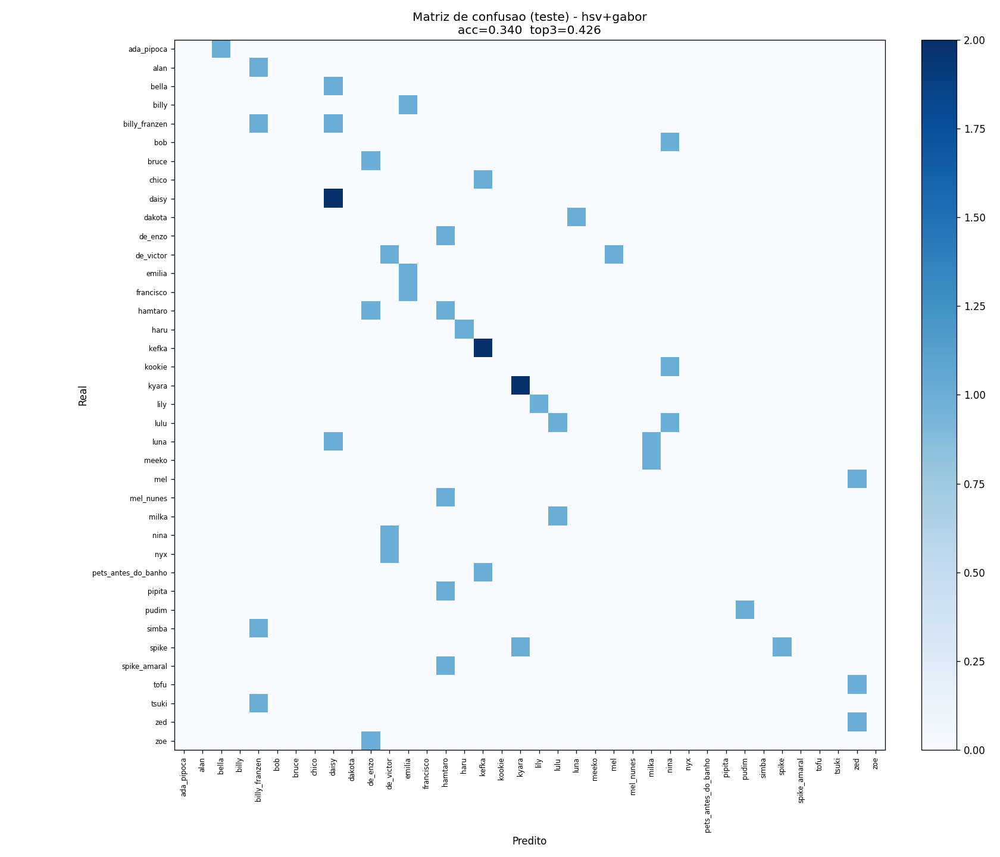
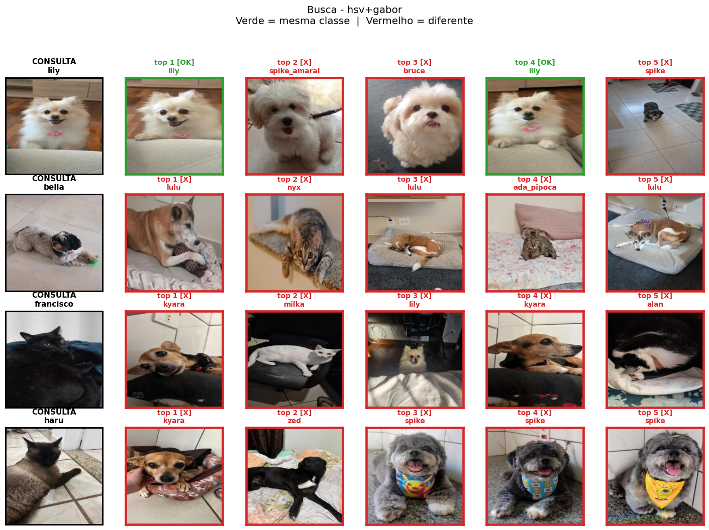

# Relatório Trabalho 3 — Processamento de Imagens

**Sistema de busca e classificação de animais de estimação**

Nome: Letícia Barbosa Neves
nUSP: 14588659
Semestre: 2026/1
Disciplina: SCC0251 (Processamento de Imagens)

---

## 1. Introdução

Este trabalho construiu um sistema de **classificação** e **busca por similaridade** sobre uma base de 367 fotos de 42 pets diferentes. Foram selecionados 5 descritores de imagem, extraídos para todas as imagens da base e depois avaliados isoladamente e em combinações, tanto para classificar a foto (identificar de qual pet é) quanto para recuperar fotos visualmente parecidas dada uma consulta.

### Organização do Código

| Arquivo / Pasta | Conteúdo |
| --- | --- |
| `codigos/descritores.py` | 5 extratores (HSV, HOG, LBP, ORB, Gabor) |
| `codigos/extrai_features.py` | Pipeline de extração — salva todos os descritores em `.npy` |
| `codigos/classificacao.py` | Split 80/10/10 + Random Forest + matriz de confusão |
| `codigos/busca.py` | Busca por distância euclidiana + métrica P@k |
| `codigos/bovw.py` | KMeans sobre ORB → histograma de visual words |
| `codigos/visualizacao.py` | UMAP + t-SNE da BoVW |
| `features/` | Vetores extraídos (`.npy` / `.pkl`) |
| `resultados/` | Tabelas e figuras geradas |

### Instalação de dependências e inicialização

Para instalar as bibliotecas necessárias:

```bash
pip install numpy matplotlib imageio scikit-image scikit-learn umap-learn
```

Para executar o pipeline completo, no diretório do trabalho:

```bash
python codigos/extrai_features.py
python codigos/classificacao.py
python codigos/busca.py
python codigos/bovw.py
python codigos/visualizacao.py
```

---

## 2. Base de dados

- **367 imagens** em formato 256×256 RGB, distribuídas em **42 classes** (pets).
- Distribuição muito desbalanceada: classes vão de **1 a 20 imagens** por pet (kefka e hamtaro têm 20; vários pets têm apenas 1 ou 3 fotos).
- **5 classes têm apenas 1 imagem** (todos os `de_bruno_*`) — excluídas da classificação conforme a regra do enunciado ("pets com menos de 3 fotos não entram"). Total efetivo para classificação: **362 imagens / 38 classes**.

---

## 3. Descritores escolhidos

Foram selecionados 5 descritores cobrindo aspectos complementares da imagem: **cor** (HSV), **forma** (HOG), **textura local** (LBP), **pontos-chave** (ORB) e **textura estatística** (Gabor). A ideia foi escolher descritores que respondem a perguntas diferentes sobre o pet ("de que cor é?", "qual o contorno?", "qual o padrão do pelo?", "tem pontos marcantes?", "que escalas/orientações de padrão aparecem?"), pois para a tarefa de identificar um pet nenhuma característica isolada deveria ser suficiente.

Para cada descritor abaixo, apresentamos: a **justificativa da escolha**, a **semântica** capturada, a **hipótese** sobre as duas tarefas, o **resultado observado** e uma análise se a hipótese foi confirmada.

### 3.1 Histograma HSV — cor

**Justificativa da escolha:** escolhemos HSV porque a primeira coisa que diferencia pets visualmente é a **cor do pelo**. HSV separa matiz (H) de brilho (V), o que é mais robusto a variação de iluminação do que histograma RGB simples — duas fotos do mesmo pet em luzes diferentes têm cores RGB diferentes mas matiz parecida.

**Semântica capturada:** distribuição global de cor (quanto há de cada matiz, saturação e brilho), ignorando posição espacial.

**Implementação:** `color.rgb2hsv` (mesmo import do notebook `Aula17` da professora) + `np.histogram` em cada canal. Dimensão final: 96 (3 canais × 32 bins, normalizado L1).

**Hipótese:**

- **Classificação:** deve ser o descritor mais forte isoladamente, porque muitos pets têm cor de pelo característica.
- **Busca:** deve recuperar pets de cor parecida com a consulta, mesmo quando não acertar o pet exato.

**Resultado observado:** classificação acc = 29.8% (top-3 = 48.9%), busca P@1 = 25.1%. **Foi o melhor descritor isolado nas duas tarefas.**

**Confirmou a hipótese?** Sim. A matriz de confusão mostra confusões concentradas em pets de cores próximas; nos rankings de busca, vizinhos errados são tipicamente pets da mesma faixa cromática (branco fofo, caramelo, preto).


### 3.2 HOG — forma / gradientes

**Justificativa da escolha:** HOG foi escolhido para capturar a **silhueta** do pet — descritor canônico para "forma" em visão computacional clássica e exatamente o tipo de descritor que a aula de segmentação cobriu. A hipótese era que pets com proporção corporal distinta (orelha em pé vs caída, focinho curto vs longo) teriam padrões de gradiente característicos.

**Semântica capturada:** histograma local de orientações de gradiente em uma grade sobre a imagem. Resume o padrão de bordas e contornos.

**Implementação:** `skimage.feature.hog` com `pixels_per_cell=(16,16)`, `cells_per_block=(2,2)`, 9 orientações. Dimensão final: **8100** (muito alta).

**Hipótese:**

- **Classificação:** incerto. HOG é bom em domínios com pose padronizada (detector de pedestres clássico), mas pets aparecem em poses muito livres. Além disso, 8100 features para ~290 amostras de treino é uma receita para overfitting.
- **Busca:** provavelmente fraco — a alta dimensionalidade tende a dominar a distância euclidiana quando concatenada com outros descritores.

**Resultado observado:** classificação acc = 12.8% (pior individual), busca P@1 = 9.4% (pior individual). Em combinações com HSV, atrapalha em vez de ajudar (hsv+hog cai para P@1 = 11.0% vs HSV puro 25.1%).

**Confirmou a hipótese?** Sim, infelizmente. A matriz de confusão está muito esparsa e sem padrão claro na diagonal. **Lição metodológica:** para usar HOG numa base pequena seria essencial aplicar PCA antes (reduzir 8100 → ~100 dims).


### 3.3 LBP uniforme — textura local

**Justificativa da escolha:** LBP foi escolhido como um descritor de **textura barato e robusto a iluminação**. Comparado ao Gabor, é muito mais leve (10 features vs 32) e captura padrão local de microestrutura — útil para diferenciar pelo curto vs longo, liso vs rajado. Também é descritor usado pela professora na aula de segmentação.

**Semântica capturada:** padrão binário do pixel central comparado aos 8 vizinhos. O histograma resume com que frequência cada padrão de textura local ocorre na imagem.

**Implementação:** `skimage.feature.local_binary_pattern` com `method='uniform'`, P=8, R=1. Dimensão final: 10.

**Hipótese:**

- **Classificação:** descritor leve mas modesto. Não se espera que discrimine pets de pelo parecido (dois gatos pretos têm LBP parecido), mas pode ajudar como complemento à cor.
- **Busca:** provavelmente fraco sozinho, mas barato o suficiente para estar sempre na combinação.

**Resultado observado:** classificação acc = 12.8%, busca P@1 = 15.5%. Combinado com HSV (`hsv+lbp`) melhora ligeiramente a busca para P@1 = 27.3% (acima do HSV puro).

**Confirmou a hipótese?** Sim. Sozinho é modesto, mas faz seu papel como complemento — a matriz mostra concentrações de erros em pets com texturas similares de pelo, exatamente como esperado.


### 3.4 ORB — keypoints binários

**Justificativa da escolha:** ORB foi escolhido especificamente como base para o **Bag of Visual Words** (seção 6), e não para uso direto. Diferente dos outros 4 descritores, ORB retorna **número variável de vetores** por imagem (uma lista de ~198 keypoints), o que impede comparação direta por distância euclidiana entre imagens. O BoVW resolve isso agregando os keypoints num histograma de tamanho fixo.

**Semântica capturada:** pontos visualmente marcantes (cantos, bordas fortes, manchas) descritos por vetores binários invariantes a rotação e escala.

**Implementação:** `skimage.feature.ORB(n_keypoints=200)`. Saída: lista de até 200 keypoints por imagem, cada um com vetor binário de 256 bits. Cobertura: 367/367 imagens com keypoints detectados (média 198 kp/img).

**Hipótese:**

- **Classificação:** não usado isoladamente (tamanho variável).
- **Busca:** agregado via BoVW. Espera-se desempenho modesto, pois keypoints respondem a "mesma cena" mais do que "mesmo pet" — variações de pose e iluminação produzem conjuntos de keypoints muito diferentes para o mesmo animal.

**Resultado observado:** BoVW com K=128 deu P@1 = 15.5%, P@5 = 8.5% — pior que HSV puro.

**Confirmou a hipótese?** Sim. Detalhamento e visualização na seção 6.

### 3.5 Banco de Filtros de Gabor — descritor *não visto em aula*

**Justificativa da escolha:** precisávamos de **um descritor fora do conteúdo de aula** (requisito do enunciado). Optamos por Gabor entre as alternativas (GLCM/Haralick também foi considerado) porque (i) é historicamente um dos descritores mais usados em visão computacional — foi a base para reconhecimento facial pré-deep learning; (ii) tem **motivação biológica** (modela células do córtex visual primário V1); (iii) captura textura em **múltiplas escalas e orientações**, o que LBP não faz; (iv) sua construção (kernel gaussiano modulado, convolução por FFT) usa exatamente as ferramentas vistas na aula de **restauração** da professora, então é didaticamente coerente com a disciplina.

**Semântica capturada:** resposta da imagem a um banco de filtros sensíveis a padrões oscilantes (listras) em frequências e orientações variadas. Para cada filtro, guardamos média e desvio padrão da magnitude do output — resumo estatístico simples mas informativo.

**Implementação:** **manual**. Kernel construído pela fórmula clássica (gaussiana 2D × cosseno/seno, rotacionada por θ); convolução via **FFT** seguindo o `filter_fd` da aula de restauração. 4 frequências × 4 orientações × 2 estatísticas = 32 features.

**Hipótese:**

- **Classificação:** desempenho médio sozinho, melhor que LBP por cobrir múltiplas escalas. Esperamos complementaridade forte com HSV — cor + textura é o casamento clássico.
- **Busca:** similar — médio sozinho, bom quando combinado com HSV.

**Resultado observado:** classificação acc = 19.1%, busca P@1 = 18.0% (segundo melhor isolado, acima de LBP e HOG). **Combinação HSV+Gabor foi a melhor configuração tanto em classificação (acc = 34.0%, top-3 = 42.6%) quanto em busca (P@1 = 26.2%, P@5 = 16.7%).**

**Confirmou a hipótese?** Sim, plenamente. As matrizes `classificacao_matriz_gabor.png` (Gabor sozinho) e `classificacao_matriz_hsv_gabor.png` (combinação) mostram a evolução: Gabor capta diferenças de textura entre pets e a melhoria fica evidente quando combinado com HSV.


---

## 4. Tarefa de Classificação

### 4.1 Metodologia

- **Filtro de classes:** removidas as 5 classes com 1 imagem → 38 classes, 362 imagens.
- **Split estratificado 80/10/10** manual (sklearn falha com classes de 3-5 amostras): para cada classe com N imagens, garantimos no mínimo 1 amostra de teste e 1 de validação, sempre preservando ≥1 no treino. Tamanhos finais: **268 treino / 47 validação / 47 teste**.
- **Padronização:** `StandardScaler` ajustado apenas no treino.
- **Classificador:** Random Forest com 300 árvores, `class_weight='balanced'` e `random_state=42`.
- **Combinações:** cada descritor isolado + concatenações com 2, 3 e 4 descritores fixos.
- **Métricas:** acurácia de validação, acurácia de teste e **acurácia top-3** (a classe correta está entre as 3 mais prováveis).

### 4.2 Resultados

| Combinação | dim | acc val | acc test | top-3 |
| --- | ---: | ---: | ---: | ---: |
| hsv | 96 | 0.255 | 0.298 | **0.489** |
| hog | 8100 | 0.085 | 0.128 | 0.191 |
| lbp | 10 | 0.191 | 0.128 | 0.255 |
| gabor | 32 | 0.170 | 0.191 | 0.340 |
| hsv+hog | 8196 | 0.149 | 0.319 | 0.383 |
| hsv+lbp | 106 | 0.234 | 0.255 | 0.447 |
| **hsv+gabor** | 128 | **0.277** | **0.340** | 0.426 |
| hog+lbp | 8110 | 0.191 | 0.149 | 0.319 |
| hog+gabor | 8132 | 0.106 | 0.191 | 0.340 |
| lbp+gabor | 42 | 0.213 | 0.149 | 0.340 |
| hsv+hog+lbp | 8206 | 0.234 | 0.106 | 0.319 |
| hsv+hog+lbp+gabor | 8238 | 0.128 | 0.191 | 0.298 |

Acurácia aleatória esperada = 1/38 ≈ 2.6%; estamos consistentemente acima disso.

### 4.3 Análise

- **HSV é o descritor mais informativo isoladamente** (acc = 29.8%, top-3 = 48.9%). Confirma a hipótese — pets têm cores distintivas.
- **HOG é o pior** sozinho (acc = 12.8%). Hipótese confirmada: 8100 features para ~290 amostras de treino é demais — Random Forest não consegue selecionar splits úteis nessa dimensionalidade.
- **HSV+Gabor é a melhor combinação** (acc val = 27.7%, acc test = 34.0%, top-3 = 42.6%). Isso é coerente com a complementaridade que prevíamos: cor + textura cobrem aspectos diferentes da aparência do pet.
- **Combinações com HOG pioram** os resultados em geral porque os 8100 features do HOG dominam o vetor concatenado mesmo após padronização (problema de dimensionalidade desbalanceada).
- **Top-3 chega a quase 49%** para HSV sozinho — o classificador "quase acerta" em metade dos casos, errando entre pets visualmente similares.

### 4.4 Limitação metodológica importante

Com apenas **47 imagens de teste** distribuídas em 38 classes (≈1.2 amostras por classe), os valores absolutos têm **alta variância** — uma única imagem que dá certo/errado por sorte do split move a acurácia em ~2%. Por isso usamos a **acurácia de validação** como critério oficial para escolher a melhor combinação (`hsv+gabor`). Para uma estimativa mais robusta seria desejável repetir o split com múltiplas seeds aleatórias e tirar a média ± desvio padrão, mas isso vai além do escopo pedido pelo enunciado (80/10/10).

### 4.5 Matriz de confusão — melhor combinação

A figura abaixo mostra a matriz de confusão da combinação `hsv+gabor` (melhor configuração). Comparada às matrizes individuais (apresentadas nas seções 3.1–3.5), a diagonal aparece mais densa, com acertos múltiplos em `kefka`, `kyara`, `lily`. As confusões remanescentes ocorrem entre pets visualmente parecidos (mesma cor e textura geral) — o tipo de erro "natural" desse problema.



---

## 5. Tarefa de Busca

### 5.1 Metodologia

- **Todas as 367 imagens** participam (busca não exige split treino/teste).
- Para cada descritor (ou combinação), aplicamos **z-score por feature** e concatenamos os blocos antes de calcular **distância euclidiana par a par**.
- Métrica: **precision@k** — para cada imagem-consulta (cujas classes têm ≥2 fotos), olhamos os top-*k* vizinhos mais próximos e medimos quantos são da mesma classe. Reportamos P@1 e P@5.

### 5.2 Resultados

| Combinação | dim | P@1 | P@5 |
| --- | ---: | ---: | ---: |
| hsv | 96 | 0.251 | 0.125 |
| hog | 8100 | 0.094 | 0.057 |
| lbp | 10 | 0.155 | 0.099 |
| gabor | 32 | 0.180 | 0.110 |
| hsv+hog | 8196 | 0.110 | 0.061 |
| hsv+lbp | 106 | 0.273 | 0.143 |
| **hsv+gabor** | 128 | **0.262** | **0.167** |
| hsv+hog+lbp | 8206 | 0.110 | 0.060 |
| hsv+hog+lbp+gabor | 8238 | 0.113 | 0.061 |

### 5.3 Análise

- **HSV+Gabor vence novamente** (P@1 = 26.2%, P@5 = 16.7%). Mesma combinação que ganhou na classificação — sugere que cor + textura é um par genuinamente complementar para essa tarefa.
- **HOG aparece consistentemente como ruído** na busca: sozinho dá P@1 = 9.4%, e em qualquer combinação que contenha HOG a métrica despenca. Isso confirma a hipótese de que a dimensionalidade do HOG (8100) domina a distância euclidiana mesmo após z-score por feature.
- **LBP sozinho** dá P@1 = 15.5%, mais que o esperado para um descritor de só 10 features — textura local é informativa para a base.
- **Gabor sozinho** dá P@1 = 18.0%, acima de LBP, sugerindo que capturar múltiplas escalas/orientações compensa.

### 5.4 Características interessantes nos rankings

Na figura `busca_top5_hsv_gabor.png`, observamos:

- Para a consulta `lily` (pomerâniana branca, peluda): top vizinhos contêm dois acertos (`lily`) e três falsos-positivos que são também **pets brancos e peludos** (`spike_amaral`, `bruce`). O sistema está acertando o conceito visual ("pet branco fofo"), apenas errando o pet exato.
- Para `bella` (pet caramelo): nenhum acerto no top-5, mas todos os vizinhos são pets pequenos castanho-claros (`de_enzo`, `lulu`, `luna`). De novo, similaridade visual capturada corretamente.
- Para `haru` (gata preta): top-5 são quase todos pets escuros (`zed`, `spike`) — captura a cor predominante.

Esses padrões mostram que o descritor está fazendo o **trabalho dele**: encontrar fotos visualmente parecidas. Os "erros" são erros de identidade do pet, não de similaridade visual — e isso é o melhor que se pode esperar de descritores que não sabem o que é "individual" daquele animal.



---

## 6. Bag of Visual Words (BoVW)

### 6.1 Construção

- **Descritores brutos:** 367 imagens × ~198 keypoints = **72.833 vetores ORB** de dimensão 256 (binários).
- **Subamostragem:** 30.000 descritores aleatórios para o KMeans.
- **Vocabulário visual:** **K=128 palavras** obtidas por `MiniBatchKMeans`.
- **Histograma por imagem:** cada keypoint é atribuído à palavra mais próxima; o histograma resultante (128 bins) é normalizado L1.
- **Busca:** distância euclidiana entre histogramas.

### 6.2 Resultado

**BoVW (K=128): P@1 = 0.155 — P@5 = 0.085.** Pior que HSV puro e muito pior que HSV+Gabor.

### 6.3 Análise

- BoVW captura **estatística de keypoints** — quais regiões "marcantes" aparecem na imagem. Pets em poses, iluminações e ângulos diferentes produzem keypoints muito diferentes, o que dilui o sinal de identidade.
- **Não tem cor:** ORB trabalha em escala de cinza. Isso explica boa parte da queda em relação a HSV.
- Em bases com muitas fotos por classe (centenas), BoVW costuma se dar bem; com ~3–20 fotos por classe, há poucas evidências para o KMeans agrupar palavras "típicas" de cada pet.

### 6.4 Visualização (UMAP e t-SNE da BoVW)

As figuras a seguir mostram os 367 histogramas de visual words projetados em 2D. As 10 classes com mais imagens estão coloridas, as demais em cinza claro.


**Observação principal:** pontos de uma mesma classe (mesma cor) estão **espalhados por todo o plano**, sem formar clusters identificáveis.

**Hipóteses para essa distribuição:**

1. **Variabilidade intra-classe alta:** cada pet aparece em fotos com iluminação, fundo e pose muito diferentes, gerando histogramas BoVW bem distintos para a mesma classe.
2. **Vocabulário visual genérico:** com K=128 palavras treinadas em todos os pets juntos, as palavras tendem a representar **estruturas comuns** (olhos, focinho, cantos de mobília) que aparecem em vários pets — não discriminam identidade individual.
3. **ORB não captura cor:** o que diferencia pets visualmente (cor do pelo) é justamente o que o BoVW por ORB ignora — então as classes acabam misturadas no espaço.

A coerência das duas projeções (UMAP e t-SNE mostrando o mesmo padrão de mistura) reforça que essa não é uma falha de visualização — é uma propriedade do **descritor BoVW por ORB** para essa base específica.

---

## 7. Conclusões

- **Melhor combinação para ambas as tarefas:** **HSV + Gabor** (cor + textura estatística). Para classificação: acc test = 34.0% (top-3 = 42.6%). Para busca: P@1 = 26.2%, P@5 = 16.7%.
- **HSV sozinho** já é um baseline forte (acc 29.8%, top-3 48.9%) e confirma a importância da cor para identificar pets.
- **HOG é prejudicial** quando combinado por causa da sua altíssima dimensionalidade (8100), que domina a distância euclidiana mesmo após padronização. Para uso futuro, valeria reduzir HOG com PCA antes de combinar.
- **BoVW por ORB foi o pior** para essa base — keypoints binários em escala de cinza não capturam o suficiente da identidade do pet, e a alta variabilidade intra-classe dilui o histograma.
- **Top-3 ≈ 49%** mostra que o sistema "quase acerta" em metade dos casos — os erros são tipicamente entre pets visualmente parecidos.
- **Limitação fundamental:** a base é pequena e desbalanceada para 38 classes. Os números absolutos têm alta variância por causa do tamanho do conjunto de teste (47 imagens, ~1.2 por classe).

---

## 8. Bibliotecas usadas

| Biblioteca | Uso | Justificativa |
| --- | --- | --- |
| `numpy`, `matplotlib`, `imageio.v3` | utilitários | mesmo stack da professora |
| `skimage.feature.{hog, LBP, ORB}` | descritores 2, 3, 4 | usado em `aulas/segmentacao/cod2.py` |
| `skimage.color.rgb2hsv` | descritor 1 | usado em `aulas/cores/Aula17-Clean.ipynb` |
| `sklearn.{ensemble, preprocessing, metrics, cluster, manifold}` | classificador, padronização, BoVW, t-SNE | enunciado autoriza |
| `umap-learn` | visualização BoVW | enunciado cita "UMAP ou t-SNE" |

O descritor **Gabor** foi implementado manualmente (kernel + convolução por FFT), seguindo a fórmula clássica e o estilo da função `filter_fd` da aula de restauração da professora.

---

## 9. Arquivos entregues

- `codigos/descritores.py` — 5 extratores
- `codigos/extrai_features.py` — pipeline de extração
- `codigos/classificacao.py` — pipeline de classificação
- `codigos/busca.py` — pipeline de busca
- `codigos/bovw.py` — pipeline BoVW
- `codigos/visualizacao.py` — UMAP + t-SNE
- `features/*.npy`, `features/orb.pkl` — vetores extraídos
- `resultados/*.png`, `resultados/*.txt` — figuras e tabelas
- `relatorio3.tex` — versão LaTeX deste relatório
- `README.md` (este arquivo)
